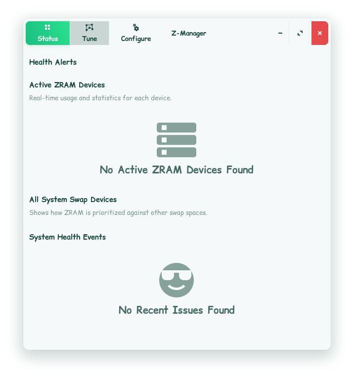
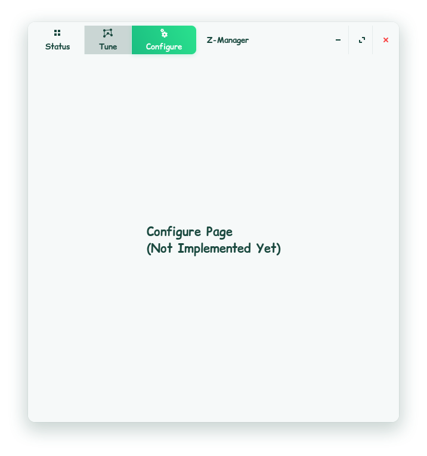
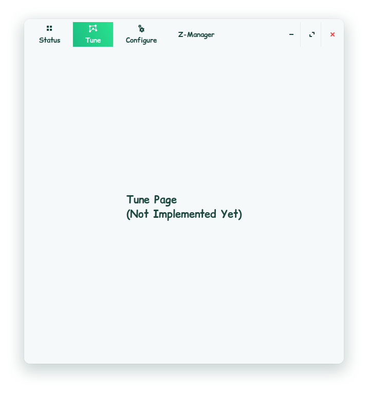

# Z-Manager

[](https://www.gnu.org/licenses/old-licenses/gpl-2.0.en.html)

A Modern GTK4 / Libadwaita GUI for Managing ZRAM on Linux.

## 🚧 Project Status: Under Heavy Development 🚧

> **This application is currently in an early development (alpha) stage.**
>
> It is not yet ready for production use. You may encounter bugs, incomplete features, or unexpected behavior. The backend logic and UI are actively being developed and are subject to change.
>
> Please feel free to explore the code, test it on a non-critical system, and report any issues you find.






## About The Project

Z-Manager is a user-friendly desktop application designed to simplify the configuration and monitoring of ZRAM on modern Linux systems. It acts as a graphical frontend for `zram-generator` and the[...]  

This tool is for desktop users and system tweakers who want to harness the performance benefits of ZRAM without the command-line hassle.

## Features

* **Easy Configuration:** Configure ZRAM size, compression algorithm, and swap priority through a simple interface.
* **Advanced Settings:** Manage advanced `zram-generator` options like writeback devices, filesystem mode, and host memory limits.
* **Configuration Profiles:** Use built-in profiles (e.g., "Desktop / Gaming") for quick and optimized setups.
* **Live Monitoring:** View real-time statistics for active ZRAM devices, including usage, compression ratio, and memory statistics.
* **System Health:** Get a clear overview of your entire system's swap configuration and diagnose potential conflicts (like an active ZSwap).
* **System Tuning:** Adjust related kernel parameters like CPU governors and I/O schedulers to further optimize performance.
* **Log Viewer:** Easily view ZRAM-related logs from the systemd journal to troubleshoot issues.

## Bugs

* **Bug 1:** zramctl- scrambled data
```py
placeholder
```

* **Bug 2:** Description of bug 2.

## Installation

Installation instructions will be provided once the application reaches a more stable release.

## Contributing

Contributions are welcome and greatly appreciated! This project is developed by an individual, and community involvement can help make it better.

If you are interested in contributing, please feel free to:
* **Open an Issue:** Report bugs, suggest new features, or ask questions.
* **Submit a Pull Request:** If you'd like to contribute code, please open an issue first to discuss the proposed changes.

You can find the issue tracker on the project's GitHub page:
[https://github.com/dragon-Elec/z-manager/issues](https://github.com/dragon-Elec/z-manager/issues)

## License

This project is licensed under the **GNU General Public License v2.0**. See the `LICENSE` file for the full license text.